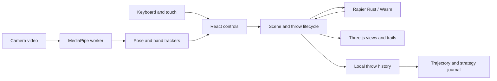

# Architecture

Throwabone is a static browser application. A host serves files; the player's
device runs the game. There are no API routes, server-side scores, accounts or
database bindings in the current design.

## Source map and ownership

| Module | Responsibility |
| --- | --- |
| `web/app/page.tsx` | React controls, mode selection and scene mounting |
| `web/lib/game/scene.ts` | Three.js objects, render loop, pointer/keyboard input, range status, traces and history persistence |
| `web/lib/game/physics.ts` | Rapier world/bodies, launch velocity/spin, contact observation, settling, guard resets and score |
| `web/lib/game/types.ts` | Settings, records, status, presets and public scene controls |
| `web/lib/game/view.ts` | First-person, target, side, overhead and follow-camera poses |
| `web/components/game/camera-throw.tsx` | Permission UI, stream/worker lifecycle, overlay, framing feedback and gesture callbacks |
| `web/lib/game/camera-access.ts` | Cancellable video permission request and error classification |
| `web/public/pose-worker.js` | Local pose/hand model loading and one-frame inference messages |
| `web/lib/game/motion.ts` | Framing, arming and underhand-release state machine |
| `web/lib/game/hand-motion.ts` | Match a hand to the selected wrist and estimate signed angular velocity |
| `web/components/game/throw-journal.tsx` | Local records, charts and comparison UI |
| `web/lib/game/webmcp.ts` | Optional local browser tool interface with bounded throw inputs |

`components/ui/` contains the shared UI component library. Legacy root-level
`bunnock*.py` files are Blender experiments and are not imported by the game.

## Coordinates and timing

- Length is in metres; Y points up. Targets are near z = 0; release starts at
  `(0, 0.75, 10.12)` and travels toward negative Z. X is lateral aim.
- Physics advances at 1/120 second. The renderer accumulates elapsed time and
  interpolates body transforms between steps. Slow motion scales simulation time.
- `ShotSettings.spin` and `spinVector` are in revolutions per second; Rapier
  receives radians per second. The manual scalar makes an end-over-end rotation.
- The far row contains 20 dynamic soldiers and two dynamic guards. The near row
  is visual context. Each bone uses the source mesh for drawing and 16 convex
  hulls for collisions.

The gravity-only aim preview is not the collision solver. Recorded paths sample
the actual simulated body. `firstLanding` is separate contact-derived data with
a confirmed defect; see R01 in [release status](release.md).

## Throw lifecycle

The UI exposes loading, aim, flight, settling, resetting and complete phases.
Release applies velocity/spin, captures the starting score, and starts tracing.
Once the world is settled, the scene resolves early-soldier penalties, stores a
record, updates the score and offers another throw or a fresh range.

There are currently two readiness checks: scene status and physics settling.
They disagree briefly after completion. Launch settings also remain mutable in
one mixed-input path. These are open defects R03 and R04, not intended contracts.

## Camera data flow

An explicit UI action requests video without audio. Frames become transferable
ImageBitmaps sent to a same-origin worker; the worker closes each frame after
inference. It returns pose/hand landmarks, frame dimensions and timestamp.
The main thread estimates a gesture, aim and spin, then calls the same scene
release API as manual controls. Models and Wasm load only for camera mode.

Only one frame is in flight. Closing camera mode or hiding the tab cancels
arming, stops camera tracks and terminates the worker. Frames and landmarks are
not saved or uploaded. Silent worker stalls still need a watchdog (R06).

## Storage and deployment

`throwabone.nickname` stores an optional name; `throwabone.throws.v1` stores up
to 30 records. Both use browser localStorage and remain device/origin-specific.
They are not authoritative scores. Validation/migration and physics-version
grouping remain open (R05/R07).

Vinext builds the React application through Vite with `output: 'export'`.
The distributable is `web/dist/client`. If a local `.openai/hosting.json` exists,
the Sites plugin also packages its metadata. Fresh clones do not need that local
manifest or any hosting credentials to build and play. See [development](development.md)
and [release status](release.md) before changing deployment behavior.
